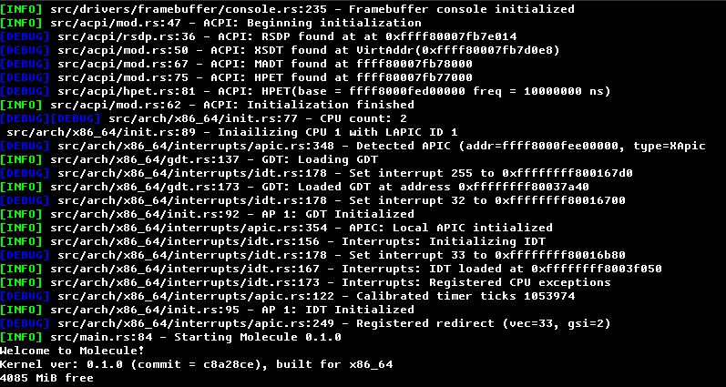

# Molecule


# About

Molecule is a lightweight monolithic Unix-like kernel written in Rust.

The goal is to provide a lightweight operating system with Rust as a first-class language, with a focus on reliability, security, and usability.

### Is this a Linux distro?

No, Molecule runs on a kernel that was built from the ground up in Rust, and does not share any source code or binaries with the Linux kernel. Molecule does take some inspiration from the Linux kernel however.

# Screenshot



# Features

The following features are currently implemented (non-exhaustive)
- Text console with PC Screen Font support
    - Partial support for ANSI escape codes
- Memory allocation
    - Buddy allocator
    - Linked list backed dynamic heap allocation
- Round robin scheduler
- ACPI support (LAPIC, I/O APIC)
- Symmetric Multiprocessing (SMP)
- Modern UEFI booting with [Limine](https://github.com/limine-bootloader/limine/)

# Goals
- Creating a modern, safe, reliable, and fast operating system
- Targetting modern architectures and CPU features
- Ease of porting software
- Developing a Rust-first operating system

# How to Build and Run
Make sure you have a Linux host system before building Molecule. If you are using Windows, use WSL 2.

## Dependencies
Before building Molecule, you need the following software installed
- `rust` (should be the latest nightly)
- `qemu` (optional: Required if you want to run it in the Qemu emulator)
- `make`
- `xorriso`
- `sgdisk` (optional: Required to create a hard drive/USB image)
- `mtools` (optional: Required to create a hard drive/USB image)

## Building Molecule
In order to build Molecule, you just need to follow a few simple steps:

Clone the repository
```bash
git clone https://github.com/EthanPlant/Molecule.git
cd Molecule
```

Building the kernel image
```base
make
```

Optionally the following environment variables can be set before running `make`:
- `RUSTPROFILE` (options=`debug`, `release`) - Set the profile the Rust compiler should use (defaults to `debug`).
- `KARCH` (options =`x86_64`, `aarch64`, `riscv64`, `loongarch64`) - Set the target architecture. Defaults to `x86_64`

## Running Molecule

The `make` command will produce a bootable ISO image. `make all-hdd` can also be used to build a raw image suitable to be flashed onto a USB stick or hard drive.

Molecule can also be run in Qemu with `make run`. By default Qemu will run with 2 CPU cores and 4 GB of available memory. `$QEMUFLAGS` can be set to control the flags passed into Qemu if desired. 